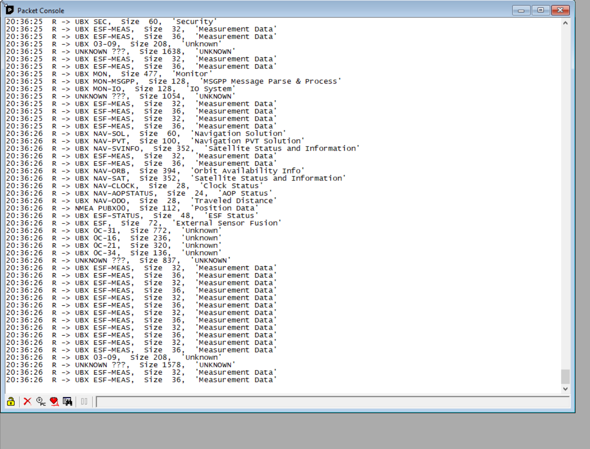
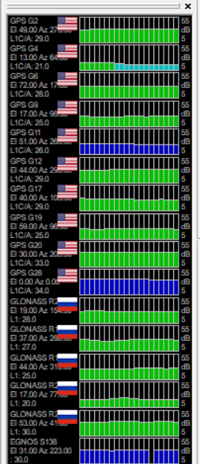

# TrackerGNSSTester

*Pass through Tracker firmware for testing GNSS using u-blox u-center*

- This firmware is for testing purposes only and does not have Tracker Edge features.
- Repository: https://github.com/rickkas7/TrackerGNSSTester
- License: MIT

The u-blox NEO-M8U on the Tracker SoM (and Tracker One) has many features that are hard to access on-device, but you can exercise using the u-blox u-center application for Winodws.

- Install u-center (original u-center, not u-center 2). Windows only!

## Firmware

- This runs with cellular off and does not have any Tracker features. It's only for GNSS debugging.
- Connect your Tracker by USB to your computer.
- Flash the TrackerGNSSTester application by USB. 

```
particle compile tracker . --saveTo firmware.bin
particle usb dfu
particle flash --usb firmware.bin
```

## Run u-center

- Run the u-center software and connect to the virtual COM port for the Tracker. It might be COM3, or another COM port.
- The baud rate doesn't matter. You can leave it at the default of 9600.
- **View - Packet Console** is a good way to make sure you're receiving data



- Using **Receiver - Debug Messages** enable more features to work in u-center.
- For example, the satellite view:




